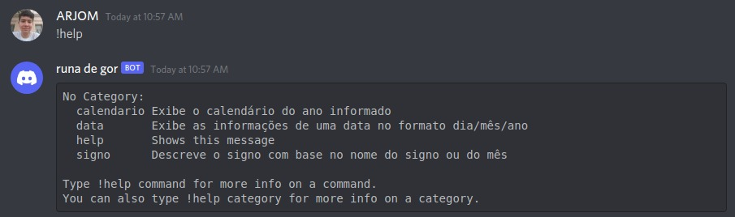
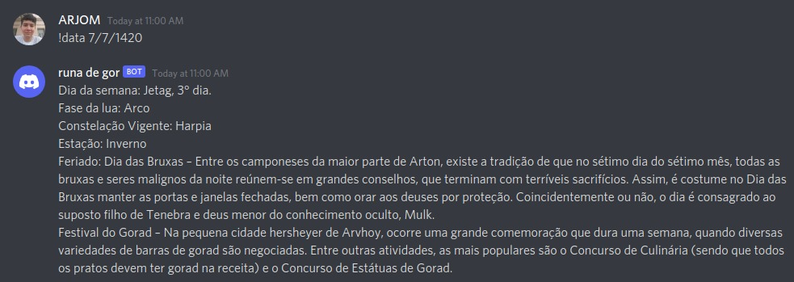
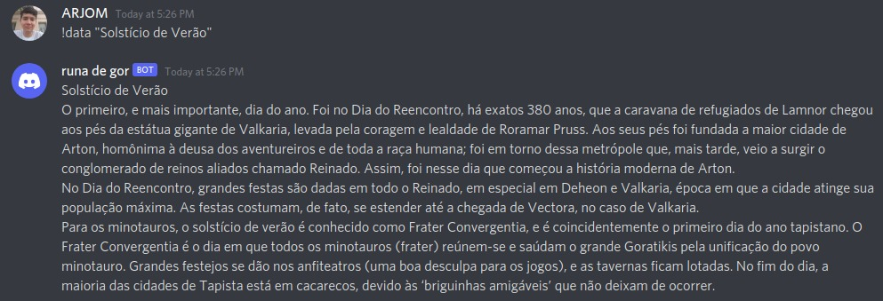
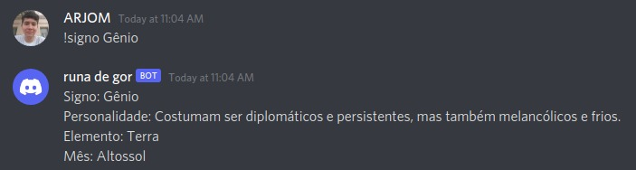
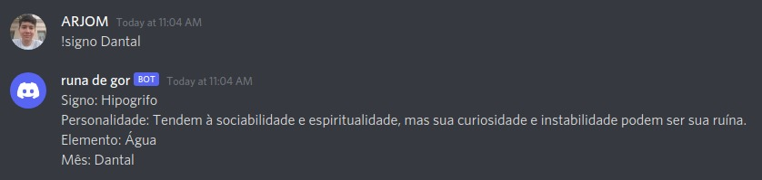
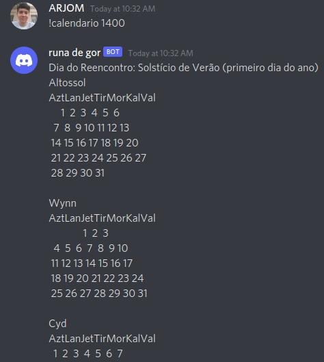

# Runa de Gor

Runa de Gor é um bot feito em python usando [Discord.py](https://discordpy.readthedocs.io/en/stable/) e escrito por [ARJOM](https://github.com/ARJOM).
Sinta-se à vontade para dar uma estrela ao repositório para promover.

O bot foi criado para auxiliar jogos de RPG no universo de Tormenta que utilizam a passagem do tempo para proporcionar uma maior imersão no jogo. O nome do bot foi escolhido por ser o nome de uma magia no universo de Tormenta que é utilizada para saber a data em seu calendário nativo.

## Comandos

Todos os comandos usam o prefixo `!`, então para evocar um comando você deve usar `!<comando> <valores>`.

### Help

Esse comando lista todos os comandos disponíveis junto de uma descrição sobre cada um.

### Data

Pode receber dois tipos de valor: de uma data no formato `dia/mês/ano` ou de um texto com o nome de alguma comemoração específica entre aspas como `"<nome-da-comemoração>"`. Para o primeiro tipo de valor é enviado uma mensagem informando o dia da semana (incluindo a posição do dia, Ex: Aztag, 1° dia.), a fase da lua naquele dia, e, caso possua, quaisquer feriados naquela data. O segundo tipo mostra apenas a descrição da festividade.

Exemplos:

### Signo

Pode receber dois tipos de valor: o nome de um signo, ou o nome de uma mês. Para qualquer valor válido informado, será enviado uma mensagem contendo os detalhes sobre o signo.

### Calendário

Recebe o valor de um ano e envia uma mensagem com a disposição do calendário do ano informado.

OBS: Esse comando ainda é um trabalho em progresso, ainda está sendo desenvolvido para ofecer uma melhor formatação.

Exemplo:

## Usando no seu servidor

Você pode adicionar a Runa de Gor no seu servidor com esse [link](https://discord.com/api/oauth2/authorize?client_id=947551594487099472&permissions=8&scope=bot), e começar a usar.
